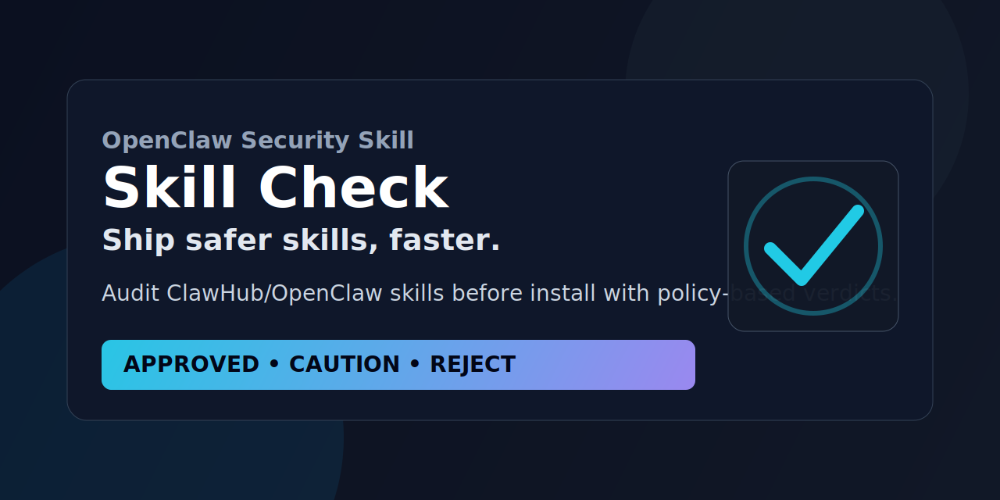

# Skill Check — Ship safer skills

Security audit gate for OpenClaw/ClawHub skills before install or use.

> **Tagline:** Move fast without shipping regret.

`skill-check` scans third-party skills for malicious patterns, undeclared capabilities, supply-chain risk, and runtime abuse — then returns a clear verdict:

- ✅ **APPROVED**
- ⚠️ **CAUTION**
- ⛔ **REJECT**

## Why this exists

Most skill installs are fast. Security reviews are usually manual (or skipped).

`skill-check` makes review repeatable and policy-driven so you can move quickly **without shipping regret**.

## Who this is for

- Builders installing 3rd-party skills from ClawHub
- Teams running OpenClaw in production
- Security-conscious operators who want a repeatable gate

## What it checks

- static risk patterns (download+exec, obfuscation, dangerous archives, etc.)
- declared vs effective capability mismatch
- policy scoring by threat category (1–4)
- optional dynamic probe for suspicious/network/system-level cases
- pre-install scan from ClawHub slug **without installing**

## Core promise

Before install, you get a deterministic verdict with policy scoring:

- ✅ **APPROVED** → safe to proceed
- ⚠️ **CAUTION** → review + explicit acceptance
- ⛔ **REJECT** → block

## Quick start

```bash
# 1) pre-install scan from ClawHub
python3 scripts/scan_hub_slug.py <slug> --category 2 --policy references/audit-policy.gc.json

# 2) local static audit
python3 scripts/static_audit.py /path/to/skill --format json > findings.json
python3 scripts/verdict.py findings.json --category 2 --policy references/audit-policy.gc.json

# 3) quick triage
scripts/quick_triage.sh /path/to/skill
```

## Enforced safe installs (new)

Use the built-in guard wrapper:

```bash
scripts/safe_install.sh <slug>
```

It audits first, then installs only if verdict is `APPROVED`.

Optional shell guard (one-time):

```bash
scripts/install_shell_guard.sh
source ~/.bashrc
```

After that, `clawhub install <slug>` is auto-routed through the security gate.

## Output

All audits produce a structured report with:

- identity + pinned version
- risk category + policy
- key findings
- verdict + next actions

Template: `references/report-template.md`

## Repo structure

- `SKILL.md` — skill instructions
- `scripts/` — triage, static audit, verdict, slug scan, safe install wrappers
- `references/` — policies, templates, risk docs

## License

Add a LICENSE file before broad redistribution.
